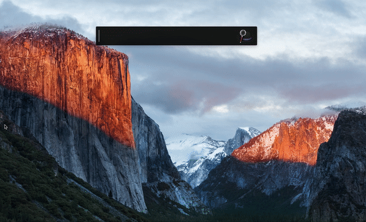

## Bear App Workflow

A simple  Alfred workflow that hooks Bear App database and allows you to search notes and tag lists.

You need to set the `db_path environment` variable to make it work.
It will probably have the value of:
`/Users/{your-usernme}/Library/Containers/net.shinyfrog.bear/Data/Documents/Application Data/database.sqlite`

## Usage

### Notes search
```
bn noteTitle
```


### Tag List Search

```
bt tagListTitle
```




